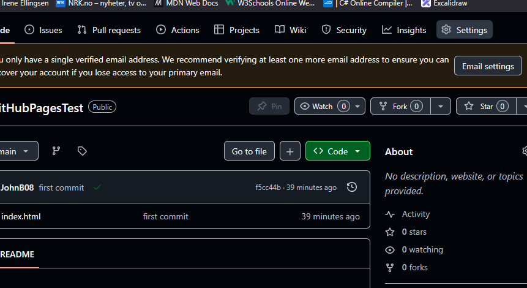
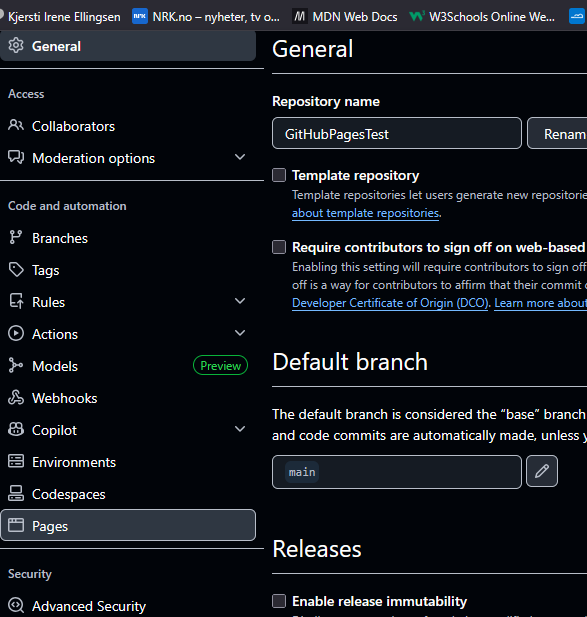
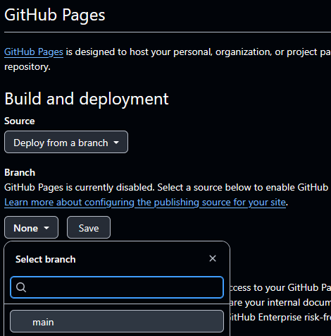
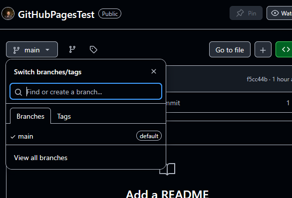
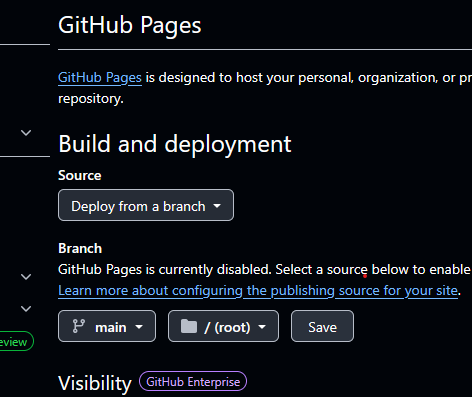
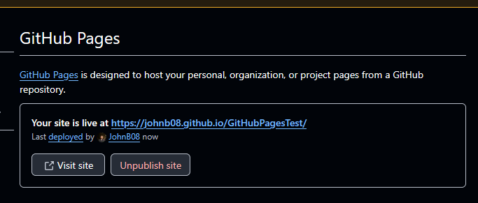

# Github Pages!

Dette er en enkel guide for hvordan hoste deres egen statisk nettside via github pages. 

Vedlagt i dette repoet er en index.html fil, som representerer nettsiden jeg vil hoste. 

Legg merke til at den ligger ikke i noen annen undermappe, men i rotmappen (root) for prosjektet. 

Etter vi har pushet prosjektet til github kan vi serve denne siden til andre via github pages.

Velg settings på repoen du vil hoste:

I settings, bla ned til du ser instillingen som heter Pages:

I pages menyen er det viktig at "Deploy from branch" er valgt. Det går ann, hvis dere trenger mer avanserte utgaver av en nettside, å lære seg github-actions, men for nå er det ikke nøvendig å kunne. 
Velg og hvilken branch dere skal hoste siden fra (Tenk, hvilken branch av prosjektet viser det ferdige produktet).

Hvis dere ikke husker hvilken branch som er hoved branchen deres, eller den branchen som viser det ferdige produktet deres, gå tilbake til repoet og se gjennom de forskjellige branchene via listen nedenfor, hvis dere har flere. 

Etter dere er sikker på at dere er på korrekt branch, kan dere lagre dette valget via Save knappen på settings.:

Etter dere har trykket lagre, må dere vente et par minutter, så kan dere refreshe settings siden.
Da vil det dukke opp en ny liten firkant, som inneholder en link til en github.io side hvor siden er hostet på. Dere kan gå inn på denne linken for å se deres nettside. 
